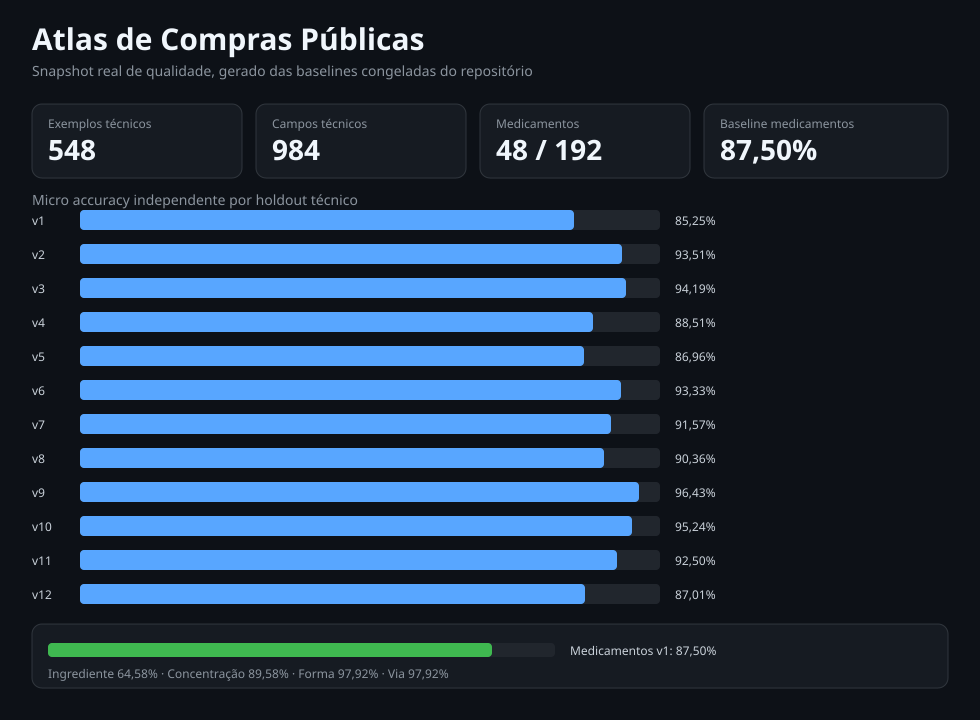

# Atlas de Compras Públicas

**Inteligência de dados auditável para compras públicas no Brasil.**

O Atlas transforma dados públicos do Portal Nacional de Contratações Públicas (PNCP) em informação comparável, rastreável e explicável. O projeto combina engenharia de dados, normalização de produtos, análise de preços e validação quantitativa para apoiar a exploração de compras públicas em diferentes regiões e períodos.

A odontologia é a primeira vertical implementada e funciona como um domínio de alta complexidade para validar o núcleo analítico.

## O que o projeto entrega

| Camada | Capacidade |
| --- | --- |
| Coleta | Captura de contratações, itens e resultados diretamente do PNCP |
| Rastreabilidade | Evidências imutáveis com SHA-256 e manifestos de proveniência |
| Consolidação | Múltiplas contratações com chaves estáveis, deduplicação e reconstrução idempotente |
| Normalização | Padronização de descrições, apresentações, medidas e atributos técnicos |
| Identidade | Product Identity Engine com atributos técnicos específicos por categoria |
| Preço físico | Base defensável e valores financeiros preservados em decimal |
| Análise | Comparação de preços com contexto geográfico e temporal |
| Qualidade | Score determinístico, cobertura semântica e cobertura de atributos técnicos |
| Sinais | Detecção estatística com MAD e IQR, sem tratar sinal como prova de irregularidade |

## Arquitetura

~~~mermaid
flowchart LR
    A[API PNCP] --> B[Evidência bruta]
    B --> C[Validação]
    C --> D[Normalização]
    D --> E[Qualidade]
    D --> F[Preço normalizado]
    F --> G[Contexto geográfico e temporal]
    G --> H[Parquet + DuckDB]
    H --> I[Grupos comparáveis]
    I --> J[MAD / IQR]
    J --> K[Sinais explicáveis]
~~~

A cadeia de rastreabilidade segue o princípio:

`sinal → grupo comparável → homologação → item → contratação → SHA-256 → resposta original → PNCP`

## Integração contínua

O repositório possui um CI enxuto em GitHub Actions para `ruff`, `pytest`,
consistência de versão, proteção de artefatos congelados e validação do snapshot.

- [Detalhes do CI](docs/ci.md)

## Stack

- Python 3.12+
- Polars
- DuckDB
- Pydantic
- httpx
- pytest
- Ruff
- Parquet

## Validação

A taxonomia é avaliada com datasets manuais versionados e fontes públicas separadas entre ciclos de desenvolvimento.

| Benchmark | Amostras | Acurácia independente |
| --- | ---: | ---: |
| v2 | 48 | 72,92% |
| v3 | 42 | 90,48% |
| v4 | 48 | 85,42% |
| v5 holdout | 48 | 79,17% |

O **v5 permanece como holdout não ajustado**, preservando uma referência independente antes de novas alterações na taxonomia. Resultados pós-tuning dos ciclos anteriores são mantidos separadamente e não substituem suas baselines originais.

A extração de atributos técnicos possui benchmark independente próprio:

| Benchmark técnico | Exemplos | Campos revisados | Micro accuracy |
| --- | ---: | ---: | ---: |
| atributos técnicos v1 | 33 | 61 | 85,25% |
| atributos técnicos v2 | 41 | 77 | 93,51% |
| atributos técnicos v3 | 45 | 86 | 94,19% |
| atributos técnicos v4 | 45 | 87 | 88,51% |
| atributos técnicos v5 | 48 | 92 | 86,96% |
| atributos técnicos v6 | 48 | 90 | 93,33% |
| atributos técnicos v7 | 48 | 83 | 91,57% |
| atributos técnicos v8 | 48 | 83 | 90,36% |
| atributos técnicos v9 | 48 | 84 | 96,43% |
| atributos técnicos v10 | 48 | 84 | 95,24% |
| atributos técnicos v11 | 48 | 80 | 92,50% |
| atributos técnicos v12 | 48 | 77 | 87,01% |

O v1 atingiu 100% na regressão pós-tuning v1.14. A baseline independente original permanece 85,25%.

O v2 usa oito contratações inéditas. Após o tuning da v1.16, o mesmo conjunto atingiu 100%, mas a baseline independente permanece 93,51%.

O v3 usa mais oito contratações inéditas. Após o tuning da v1.18, o mesmo conjunto atingiu 100% nos atributos e 45/45 categorias, mas as baselines independentes permanecem 94,19% e 93,33%.

O v4 adiciona contexto negativo, abreviações comerciais e grafias não padronizadas. A baseline independente ficou em 88,51%, com 42/45 categorias corretas e um falso positivo contextual. Após o tuning da v1.20, o mesmo conjunto atingiu 100% nos atributos e 45/45 categorias, sem substituir a baseline independente.

O v5 amplia os negativos contextuais e alternativas explícitas. A baseline independente ficou em 86,96%, com 39/48 categorias corretas, 2 falsos positivos técnicos e 10 falsos negativos. Após o tuning da v1.22, o mesmo conjunto atingiu 100% nos atributos e 48/48 categorias, sem substituir a baseline independente.

O v6 usa oito novas contratações e reforça negativos de contexto ligados a resina. A baseline independente ficou em 93,33%, com 44/48 categorias corretas e nenhum falso positivo técnico. Após o tuning da v1.24, o mesmo conjunto atingiu 100% nos atributos e 48/48 categorias, sem substituir a baseline independente.

O v7 usa outras oito contratações inéditas após a v1.24. A baseline independente ficou em 91,57% de micro accuracy, com 43/48 categorias corretas, 1 falso positivo técnico, 6 falsos negativos e nenhum mismatch. Após o tuning da v1.26, o mesmo conjunto atingiu 100% nos atributos e 48/48 categorias, sem substituir a baseline independente.

O v8 usa oito novas contratações e trechos fiéis das descrições públicas. A baseline independente ficou em 90,36% de micro accuracy, com 43/48 categorias corretas, 5 falsos positivos técnicos, 3 falsos negativos e nenhum mismatch. Após o tuning da v1.28, o mesmo conjunto atingiu 100% nos atributos e 48/48 categorias, sem substituir a baseline independente.

O v9 usa outras oito contratações inéditas e preserva descrições comerciais curtas, pontuação interna e composição subordinada. A baseline independente ficou em 96,43% de micro accuracy, com 42/48 categorias corretas, 1 falso positivo técnico, 2 falsos negativos e nenhum mismatch. Após o tuning da v1.30, o mesmo conjunto atingiu 100% nos atributos e 48/48 categorias, sem substituir a baseline independente.

O v10 usa mais oito contratações inéditas e adiciona conflito explícito entre vasoconstritores, ionômero reforçado por resina, linguagem livre de cura pela luz e produtos fluoretados fora das formas canônicas. A baseline independente ficou em 95,24% de micro accuracy, com 45/48 categorias corretas, 1 falso positivo técnico, 3 falsos negativos e nenhum mismatch. Após o tuning da v1.32, o mesmo conjunto atingiu 100% nos atributos e 48/48 categorias, sem substituir a baseline independente.

O v11 usa oito novas contratações com descrições ainda mais curtas e ruidosas, incluindo `CIV`, `RESINA A1`, revelador para película e pontuação interna na identidade do produto. A baseline independente ficou em 92,50% de micro accuracy, com 36/48 categorias corretas, nenhum falso positivo técnico, 6 falsos negativos e nenhum mismatch. Após o tuning da v1.34, o mesmo conjunto atingiu 100% nos atributos e 48/48 categorias, sem substituir a baseline independente.

O v12 usa oito novas contratações e amplia a adversarialidade com `RX`, `SV`, `Z100`, `AUTO-CONDICIONANTE`, `FENILEFINA` e descrições comerciais muito curtas. A baseline independente ficou em 87,01% de micro accuracy, com 35/48 categorias corretas, nenhum falso positivo técnico, 10 falsos negativos e nenhum mismatch. Após o tuning da v1.37, o mesmo conjunto atingiu 100% nos atributos e 48/48 categorias, sem substituir a baseline independente.

Documentação completa:

- [Benchmark v1](docs/benchmark-v1.md)
- [Benchmark v2](docs/benchmark-v2.md)
- [Benchmark v3](docs/benchmark-v3.md)
- [Benchmark v4](docs/benchmark-v4.md)
- [Benchmark v5](docs/benchmark-v5.md)
- [Benchmark de atributos técnicos v1](docs/benchmark-technical-attributes-v1.md)
- [Regressão técnica pós-tuning v1.14](docs/benchmark-technical-attributes-v1-post-tuning.md)
- [Benchmark de atributos técnicos v2](docs/benchmark-technical-attributes-v2.md)
- [Regressão técnica v2 pós-tuning v1.16](docs/benchmark-technical-attributes-v2-post-tuning.md)
- [Benchmark de atributos técnicos v3](docs/benchmark-technical-attributes-v3.md)
- [Regressão técnica v3 pós-tuning v1.18](docs/benchmark-technical-attributes-v3-post-tuning.md)
- [Benchmark de atributos técnicos v4](docs/benchmark-technical-attributes-v4.md)
- [Regressão técnica v4 pós-tuning v1.20](docs/benchmark-technical-attributes-v4-post-tuning.md)
- [Benchmark de atributos técnicos v5](docs/benchmark-technical-attributes-v5.md)
- [Regressão técnica v5 pós-tuning v1.22](docs/benchmark-technical-attributes-v5-post-tuning.md)
- [Benchmark de atributos técnicos v6](docs/benchmark-technical-attributes-v6.md)
- [Regressão técnica v6 pós-tuning v1.24](docs/benchmark-technical-attributes-v6-post-tuning.md)
- [Benchmark de atributos técnicos v7](docs/benchmark-technical-attributes-v7.md)
- [Regressão técnica v7 pós-tuning v1.26](docs/benchmark-technical-attributes-v7-post-tuning.md)
- [Benchmark de atributos técnicos v8](docs/benchmark-technical-attributes-v8.md)
- [Regressão técnica v8 pós-tuning v1.28](docs/benchmark-technical-attributes-v8-post-tuning.md)
- [Benchmark de atributos técnicos v9](docs/benchmark-technical-attributes-v9.md)
- [Regressão técnica v9 pós-tuning v1.30](docs/benchmark-technical-attributes-v9-post-tuning.md)
- [Benchmark de atributos técnicos v10](docs/benchmark-technical-attributes-v10.md)
- [Regressão técnica v10 pós-tuning v1.32](docs/benchmark-technical-attributes-v10-post-tuning.md)
- [Benchmark de atributos técnicos v11](docs/benchmark-technical-attributes-v11.md)
- [Regressão técnica v11 pós-tuning v1.34](docs/benchmark-technical-attributes-v11-post-tuning.md)
- [Benchmark de atributos técnicos v12](docs/benchmark-technical-attributes-v12.md)
- [Regressão técnica v12 pós-tuning v1.37](docs/benchmark-technical-attributes-v12-post-tuning.md)
- [Consolidação dos benchmarks técnicos v1–v11](docs/benchmark-technical-consolidated-v1-v11.md)
- [Revisão da arquitetura de regras e contextos](docs/architecture-rules-review.md)

## Exemplo de normalização

Entrada:

~~~text
RES FOTOP A2 C/2 SERINGAS 4G
~~~

Saída estruturada:

~~~text
categoria: composite_resin
cor: A2
apresentacao: syringe
quantidade_embalagem: 2
quantidade_unitaria: 4 g
quantidade_total: 8 g
~~~

Quando descrição, embalagem e medidas sustentam a conversão, o pipeline normaliza o preço pela quantidade física. Múltiplas medidas incompatíveis e kits heterogêneos ficam em `review` e não entram nos sinais estatísticos.

## Uso rápido

Instalação em modo de desenvolvimento:

~~~bash
pip install -e ".[dev]"
~~~

Capturar uma contratação:

~~~bash
dpi capture-contract \
  --cnpj <CNPJ> \
  --year <ANO> \
  --sequence <SEQUENCIAL>
~~~

Construir a camada analítica:

~~~bash
dpi build-analytics \
  --raw <ARQUIVO_DE_ITENS> \
  --database data/analytics.duckdb
~~~

Consolidar todas as contratações capturadas:

~~~bash
dpi build-award-dataset \
  --bundles-root data/raw/contracts \
  --database data/analytics.duckdb
~~~

Gerar sinais estatísticos:

~~~bash
dpi detect-anomalies --database data/analytics.duckdb
~~~

## Domínio de medicamentos

A arquitetura multidomínio já possui uma taxonomia inicial de medicamentos,
mas ela ainda não está ativa em produção.

O primeiro holdout independente contém 48 exemplos e 192 campos.
A baseline ficou em **87,50%** de micro accuracy, com melhor desempenho
em forma farmacêutica e via do que em ingrediente ativo.

Após o tuning da v1.44, o mesmo conjunto congelado atingiu
**192/192 campos corretos e 100% de micro accuracy**, sem substituir
a baseline independente.

O segundo holdout independente contém outras 8 contratações e 192 campos.
A baseline do v2 ficou em **79,69%**, com 58,33% em ingrediente ativo,
97,92% em concentração e 81,25% em forma farmacêutica e via. Nenhuma
lacuna do v2 é corrigida na v1.45.

~~~bash
dpi evaluate-medications --dataset data/evaluation/medications-v1.jsonl
dpi medication-errors --dataset data/evaluation/medications-v1.jsonl
~~~

- [Benchmark independente de medicamentos v1](docs/benchmark-medications-v1.md)
- [Medicamentos v1 pós-tuning v1.44](docs/benchmark-medications-v1-post-tuning.md)
- [Benchmark independente de medicamentos v2](docs/benchmark-medications-v2.md)

O domínio permanece em `benchmark_required` até um novo holdout independente pós-tuning.

## Snapshot real

O primeiro snapshot publicado é gerado exclusivamente das baselines congeladas
do projeto: 548 exemplos técnicos, 984 campos técnicos e o benchmark independente
de medicamentos.

- [Abrir snapshot HTML](docs/dashboard-quality-snapshot.html)
- [Dados auditáveis do snapshot](docs/dashboard-quality-snapshot.json)

O snapshot não simula preços, homologações ou sinais. Esses painéis só serão
publicados quando existir uma base DuckDB analítica consolidada.

## API e dashboard

A camada analítica pode ser exposta por API HTTP ou por um dashboard HTML estático,
ambos alimentados pelo mesmo DuckDB.

~~~bash
pip install -e ".[api]"
dpi serve-api --database data/analytics.duckdb
dpi build-dashboard --database data/analytics.duckdb --output docs/dashboard.html
~~~

- [Documentação da API e dashboard](docs/api-dashboard.md)

Nenhum valor é fixado no dashboard. O snapshot é gerado a partir da base analítica
informada no comando.

A API v1 oferece paginação por `limit`/`offset` e filtros por categoria,
macroregião, ano e escopo, conforme a coleção.

## Estrutura

~~~text
src/dental_procurement_intelligence/
  pncp/             cliente e modelos do PNCP
  ingestion/        captura e evidências
  identity/         taxonomia e identidade de produto
  evaluation/       benchmarks e métricas
  normalization/    texto, medidas e geografia
  analytics/        lakehouse, homologações e sinais
  cli.py            interface de linha de comando

data/
docs/
tests/
~~~

O namespace Python histórico é mantido por compatibilidade interna. O produto público é **Atlas de Compras Públicas**.

## Documentação técnica

- [Arquitetura](docs/architecture.md)
- [Revisão do motor de regras](docs/architecture-rules-review.md)
- [Refatoração declarativa do motor de regras v1.36](docs/rule-engine-refactor-v1.36.md)
- [Arquitetura multidomínio](docs/multidomain-architecture.md)
- [API e dashboard analítico](docs/api-dashboard.md)
- [Benchmark de medicamentos v1](docs/benchmark-medications-v1.md)
- [Consolidação técnica v1–v11](docs/benchmark-technical-consolidated-v1-v11.md)
- [Dataset multi-contratação](docs/multi-contratacao.md)
- [Metodologia de sinais de preço](docs/metodologia-anomalias.md)
- [Precisão monetária](docs/precisao-monetaria.md)
- [Atributos técnicos](docs/atributos-tecnicos.md)
- [Qualidade do normalizador](docs/qualidade-normalizador.md)
- [Benchmarks e validação](docs/benchmark-v5.md)

## Próximos passos

- fazer tuning controlado do benchmark independente de medicamentos v2
- consolidar uma base DuckDB real para os painéis de preços e homologações

## Fonte dos dados

Os dados são obtidos da API pública do **Portal Nacional de Contratações Públicas (PNCP)**.

O projeto preserva a evidência de origem e separa dados brutos, transformações analíticas e resultados derivados para permitir auditoria e reprodução.
