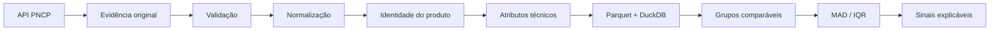

<div align="center">

# Atlas de Compras Públicas

Plataforma de inteligência sobre compras públicas que estrutura itens do PNCP, compara preços homologados e preserva a evidência de origem para auditoria.

[](https://github.com/peedrovinicius/atlas-compras-publicas/actions/workflows/ci.yml)


[Demo ao vivo](https://atlas-compras-publicas-web.onrender.com) · [Swagger / OpenAPI](https://atlas-compras-publicas.onrender.com/docs) · [Documentação](docs/README.md) · [Snapshot de qualidade](docs/dashboard-quality-snapshot.html) · [Arquitetura](docs/architecture.md)

</div>

Dados de compras públicas chegam com descrições heterogêneas. O mesmo produto pode aparecer escrito de várias formas, o que dificulta comparar itens e preços sem misturar objetos incompatíveis.

O Atlas captura contratações, itens e resultados do PNCP, preserva as respostas originais com SHA-256 e manifestos, normaliza descrições, extrai atributos técnicos e constrói identidades comparáveis.

Hoje, a vertical odontológica possui 548 exemplos independentes e 984 campos técnicos avaliados, com micro accuracy ponderada de 91,36%.

A aplicação pública já permite pesquisar produtos, comparar preços homologados, acompanhar histórico e diferenças regionais, identificar fornecedores e órgãos compradores e consultar sinais estatísticos com rastreabilidade até o PNCP.

## Exemplo real: antes e depois

Exemplo proveniente do holdout público `data/evaluation/v5.jsonl`, item `lr-350`:

```text
PRIME ADESIVO FRASCO 4ML
```

Saída do parser atual:

```text
adesivo odontológico | frasco | 4 ml/un | medida não ambígua
```

A documentação detalhada registra a origem, os campos extraídos e a forma de reprodução sem correção manual.

[Ver exemplo real e reproduzível](docs/exemplo-parser-real.md)

## O problema

Descrições do PNCP variam em abreviações, ordem das palavras, apresentação, unidade, quantidade e atributos técnicos. Uma comparação direta por texto pode aproximar produtos diferentes ou separar produtos equivalentes.

O Atlas resolve essa etapa antes da análise de preços e mantém a trilha de evidência usada em cada transformação.

## O que o Atlas já entrega

| Camada | Entrega atual |
| --- | --- |
| Coleta | Captura de contratações, itens e resultados do PNCP |
| Evidência | SHA-256 e manifestos para preservar a origem |
| Normalização | Descrição, apresentação, medidas e atributos técnicos |
| Identidade | Regras de comparação entre produtos estruturados |
| Analítica | DuckDB consolidado com busca, resumo de preços, histórico e geografia |
| Mercado | Fornecedores e órgãos compradores por produto comparável |
| Qualidade | Benchmarks congelados, regressões e CI automatizado |
| Sinais | MAD e IQR como sinais estatísticos explicáveis, com acesso aos registros de origem |

Sinal estatístico não é tratado como prova de irregularidade.

## Resultado comprovado

A extração de atributos técnicos possui 12 ciclos independentes de benchmark.

| Métrica | Resultado |
| --- | ---: |
| Exemplos independentes | 548 |
| Campos técnicos avaliados | 984 |
| Campos corretos | 899 |
| Micro accuracy ponderada | 91,36% |

As baselines independentes são preservadas. Resultados pós-tuning são registrados separadamente e não substituem medições anteriores.

[Ver consolidação técnica v1-v12](docs/benchmark-technical-consolidated-v1-v12.md)

## SQL e modelo analítico

O warehouse atual usa DuckDB e expõe três camadas principais:

- `silver_items`: itens normalizados e qualidade da estruturação;
- `silver_awards`: resultados homologados com contexto, preços e hashes de origem;
- `gold_price_signals`: grupos comparáveis, MAD/IQR e sinais explicáveis.

As consultas SQL do portfólio são executadas no CI contra um schema DuckDB compatível com o contrato atual.

- [Evolução mensal de preços](sql/01_price_evolution.sql)
- [Dispersão por grupo comparável](sql/02_group_dispersion.sql)
- [Diferença regional para a mediana nacional](sql/03_regional_gap.sql)
- [Cobertura da normalização](sql/04_normalization_coverage.sql)
- [Rastreabilidade de um sinal](sql/05_signal_trace.sql)
- [Contrato do warehouse v1](docs/warehouse-v1.md)
- [Como reconstruir a amostra analítica](data/demo/README.md)

Para reconstruir a base local usada na evolução analítica:

```bash
atlas build-demo-data
```

## Arquitetura e rastreabilidade



Cadeia de rastreabilidade:

```text
sinal -> grupo comparável -> homologação -> item -> contratação -> SHA-256 -> resposta original -> PNCP
```

[Arquitetura detalhada](docs/architecture.md)

## Qualidade e validação

O projeto usa:

- `pytest` para testes automatizados;
- `Ruff` para lint e consistência;
- GitHub Actions como gate de CI;
- datasets de avaliação versionados e congelados;
- separação explícita entre baseline independente e pós-tuning;
- hashes para proteger artefatos históricos de avaliação.

O CI atual executa `ruff check .`, `pytest -q` e o build TypeScript/Vite do frontend.

[Snapshot de qualidade](docs/dashboard-quality-snapshot.html) · [Dados do snapshot](docs/dashboard-quality-snapshot.json)

## Aplicação pública

A aplicação publicada usa React + TypeScript no frontend e FastAPI + DuckDB na camada analítica:

- [Abrir Atlas](https://atlas-compras-publicas-web.onrender.com)
- [Swagger / OpenAPI](https://atlas-compras-publicas.onrender.com/docs)
- [Health check](https://atlas-compras-publicas.onrender.com/health)

A experiência pública possui duas áreas.

**Explorar preços** é a entrada principal. A pesquisa encontra identidades de produto na base analítica e expõe:

- mediana, percentis e tamanho da amostra comparável;
- distribuição dos preços normalizados por faixa;
- histórico mensal de preços;
- comparação por região e UF;
- fornecedores e órgãos compradores;
- sinais estatísticos com aviso metodológico explícito;
- cartões de evidência com contexto da compra, status da normalização, hashes de origem e link para o PNCP;
- filtros por período, região, UF, fornecedor e órgão/unidade, aplicados de forma consistente em toda a análise;
- paginação da pesquisa de produtos, preservando o total de grupos compatíveis;
- ordenação por cobertura, número de compras, atualização recente ou nome;
- compartilhamento de análises por URL com filtros, ordenação, página e produto selecionado;
- exportação CSV dos registros filtrados;
- histórico visual com mediana e faixa interquartil, mantendo a tabela detalhada;
- descoberta guiada por categorias que realmente existem na base, com contagem de grupos e preços;
- interpretação de termos comuns em português, como `adesivo odontológico`, `ionômero de vidro`, `resina flow`, `anestésico local` e `flúor`;
- autocomplete com produtos reais da base a partir de 2 caracteres;
- tolerância conservadora a pequenos erros de digitação em nomes de categorias conhecidas;
- busca textual genérica sem depender de acentos;
- navegação do autocomplete por teclado com `↑`, `↓`, `Enter` e `Esc`;
- recuperação de busca vazia com atalhos para categorias realmente disponíveis;
- resultados com mediana de preço, atualização e cobertura visíveis antes de abrir a análise;
- filtros aplicados exibidos como chips removíveis;
- termos usuais como `CIV`, `cimento de vidro`, `bonding` e `anestesia local` reconhecidos diretamente;
- refinamentos clicáveis por cor, apresentação e atributos técnicos, com contagem real de grupos compatíveis;
- pesquisas recentes armazenadas somente no navegador do usuário, com opção de limpar;
- reforma visual da interface pública, com busca em destaque, filtros avançados recolhidos, cabeçalho simplificado e hierarquia mais limpa;
- análise dividida em Visão geral, Mercado e Evidências para reduzir rolagem e excesso de informação na mesma tela.

**Laboratório** mantém o normalizador interativo. É possível digitar descrições livres ou clicar diretamente nas categorias reconhecidas para executar o parser real e inspecionar atributos técnicos, medidas e termos identificados.

O endereço da análise preserva o recorte atual, permitindo compartilhar a mesma pesquisa, filtros, ordenação, página e produto selecionado. Os registros filtrados também podem ser exportados diretamente em CSV.

Principais endpoints analíticos:

```text
GET /api/v1/products/discovery
GET /api/v1/products/search?q=...
GET /api/v1/products/{product_id}
GET /api/v1/products/{product_id}/distribution
GET /api/v1/products/{product_id}/history
GET /api/v1/products/{product_id}/regions
GET /api/v1/products/{product_id}/suppliers
GET /api/v1/products/{product_id}/buyers
GET /api/v1/products/{product_id}/signals
GET /api/v1/products/{product_id}/records
GET /api/v1/products/{product_id}/records.csv
```

## Quickstart


Requer Python 3.12+.

```bash
git clone https://github.com/peedrovinicius/atlas-compras-publicas.git
cd atlas-compras-publicas
pip install -e ".[dev]"
atlas evaluate-taxonomy --dataset data/evaluation/v5.jsonl
atlas capture-contract --cnpj 01612541000133 --year 2026 --sequence 47
```

O último comando usa uma contratação já referenciada no dataset congelado v5.

## Stack e decisões técnicas

| Tecnologia | Papel no projeto |
| --- | --- |
| Python 3.12+ | Pipeline, regras, CLI e integração das camadas |
| Polars | Transformações colunares e processamento analítico |
| DuckDB | Consulta e consolidação analítica local e reproduzível |
| Parquet | Persistência colunar interoperável |
| Pydantic | Validação tipada das estruturas do PNCP |
| httpx | Cliente HTTP para a API do PNCP |
| FastAPI | API pública e contratos HTTP |
| React + TypeScript | Aplicação web pública e laboratório do parser |
| Vite | Build e desenvolvimento do frontend |
| pytest | Regressão e proteção das regras |
| Ruff | Lint e consistência de código |

## Escopo

**Odontologia é a vertical principal.**

O domínio `medications` permanece experimental e isolado da classificação odontológica principal. A auditoria da issue #30 confirmou que os 192 exemplos congelados em v1-v4 pertencem ao escopo farmacêutico.

Materiais, dispositivos e outros produtos de saúde não serão agrupados em `medications`: cada tipo deverá ter domínio, regras e benchmark próprios.

As baselines históricas v1-v4 permanecem preservadas sem rename retroativo.

[Ver fronteiras dos domínios de saúde](docs/architecture-health-domains.md)

## Limitações e próximos passos

- a cobertura pública reflete os registros presentes na base analítica publicada e não deve ser interpretada como o universo integral do PNCP;
- estatísticas de preço dependem da identidade comparável e de normalizações consideradas defensáveis; a interface sinaliza quando a amostra fica abaixo do mínimo metodológico;
- sinais estatísticos indicam distância da distribuição observada e não constituem prova de irregularidade;
- medicamentos permanece experimental e separado de materiais e dispositivos, conforme a auditoria da issue #30;
- o namespace Python `dental_procurement_intelligence` e o alias legado `dpi` são mantidos por compatibilidade; a CLI pública já pode ser chamada por `atlas`;
- novas verticais devem entrar somente com domínio, regras e benchmark independentes.

## Estrutura do repositório

```text
src/dental_procurement_intelligence/
  pncp/             cliente e modelos do PNCP
  ingestion/        captura e evidências
  identity/         taxonomia e identidade de produto
  evaluation/       benchmarks e métricas
  normalization/    texto, medidas e geografia
  analytics/        lakehouse, homologações e sinais
  cli.py            interface de linha de comando

web/                 frontend React + TypeScript
sql/                 consultas analíticas versionadas
data/evaluation/     datasets e baselines congeladas
docs/                arquitetura, metodologia e histórico técnico
tests/               testes automatizados
```

## Documentação

- [Release v1.62.0](docs/release-v1.62.0.md)
- [Release v1.61.0](docs/release-v1.61.0.md)
- [Release v1.60.0](docs/release-v1.60.0.md)
- [Release v1.59.0](docs/release-v1.59.0.md)
- [Release v1.58.0](docs/release-v1.58.0.md)
- [Release v1.57.0](docs/release-v1.57.0.md)
- [Release v1.56.0](docs/release-v1.56.0.md)
- [Release v1.55.0](docs/release-v1.55.0.md)
- [Release v1.54.0](docs/release-v1.54.0.md)
- [Release v1.53.0](docs/release-v1.53.0.md)
- [Release v1.52.0](docs/release-v1.52.0.md)
- [Release v1.51.0](docs/release-v1.51.0.md)
- [Índice técnico](docs/README.md)
- [Arquitetura](docs/architecture.md)
- [Metodologia de sinais](docs/metodologia-anomalias.md)
- [Consolidação técnica v1-v12](docs/benchmark-technical-consolidated-v1-v12.md)
- [Qualidade do normalizador](docs/qualidade-normalizador.md)
- [Changelog](CHANGELOG.md)

## Fonte dos dados

Os dados são obtidos da API pública do Portal Nacional de Contratações Públicas. O projeto preserva dados brutos, transformações e resultados derivados para permitir auditoria e reprodução.

## Contribuição e contato

Contribuições devem preservar rastreabilidade, baselines independentes e metodologia documentada.

[CONTRIBUTING.md](CONTRIBUTING.md) · [SECURITY.md](SECURITY.md) · [SUPPORT.md](SUPPORT.md) · [Código de Conduta](CODE_OF_CONDUCT.md)

Mantenedor: [Pedro Vinícius](https://github.com/peedrovinicius)
