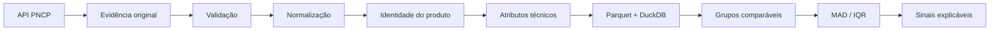

<div align="center">

# Atlas de Compras Públicas

Transforma descrições do PNCP em produtos estruturados e comparáveis, preservando a evidência de origem para auditoria.

[](https://github.com/peedrovinicius/atlas-compras-publicas/actions/workflows/ci.yml)


[Documentação](docs/README.md) · [Snapshot de qualidade](docs/dashboard-quality-snapshot.html) · [Arquitetura](docs/architecture.md) · [Changelog](CHANGELOG.md)

</div>

## Em 15 segundos

Dados de compras públicas chegam com descrições heterogêneas. O mesmo produto pode aparecer escrito de várias formas, o que dificulta comparar itens e preços sem misturar objetos incompatíveis.

O Atlas captura contratações, itens e resultados do PNCP, preserva as respostas originais com SHA-256 e manifestos, normaliza descrições, extrai atributos técnicos e constrói identidades comparáveis.

Hoje, a vertical odontológica possui 548 exemplos independentes e 984 campos técnicos avaliados, com micro accuracy ponderada de 91,36%.

Painéis públicos de preços e sinais ainda não são publicados porque dependem de uma base DuckDB analítica consolidada.

## Exemplo real: antes e depois

Entrada:

```text
RES FOTOP A2 C/2 SERINGAS 4G
```

Saída estruturada:

```text
resina composta | A2 | seringa | 2 un | 4 g/un | 8 g total
```

Esse tipo de transformação permite comparar itens pelo que eles representam, não apenas pelo texto bruto.

## O problema

Descrições do PNCP variam em abreviações, ordem das palavras, apresentação, unidade, quantidade e atributos técnicos. Uma comparação direta por texto pode aproximar produtos diferentes ou separar produtos equivalentes.

O Atlas resolve essa etapa antes da análise de preços e mantém a trilha de evidência usada em cada transformação.

## O que o Atlas já entrega

| Camada | Entrega atual |
| --- | --- |
| Coleta | Captura de contratações, itens e resultados do PNCP |
| Evidência | SHA-256 e manifestos para preservar a origem |
| Normalização | Descrição, apresentação, medidas e atributos técnicos |
| Identidade | Regras de comparação entre produtos estruturados |
| Analítica | Parquet e DuckDB para consolidação local |
| Qualidade | Benchmarks congelados, regressões e CI automatizado |
| Sinais | MAD e IQR implementados como sinais estatísticos explicáveis |

Sinal estatístico não é tratado como prova de irregularidade.

## Resultado comprovado

A extração de atributos técnicos possui 12 ciclos independentes de benchmark.

| Métrica | Resultado |
| --- | ---: |
| Exemplos independentes | 548 |
| Campos técnicos avaliados | 984 |
| Campos corretos | 899 |
| Micro accuracy ponderada | 91,36% |

As baselines independentes são preservadas. Resultados pós-tuning são registrados separadamente e não substituem medições anteriores.

[Ver consolidação técnica v1-v12](docs/benchmark-technical-consolidated-v1-v12.md)

## Arquitetura e rastreabilidade



Cadeia de rastreabilidade:

```text
sinal -> grupo comparável -> homologação -> item -> contratação -> SHA-256 -> resposta original -> PNCP
```

[Arquitetura detalhada](docs/architecture.md)

## Qualidade e validação

O projeto usa:

- `pytest` para testes automatizados;
- `Ruff` para lint e consistência;
- GitHub Actions como gate de CI;
- datasets de avaliação versionados e congelados;
- separação explícita entre baseline independente e pós-tuning;
- hashes para proteger artefatos históricos de avaliação.

O CI atual executa `ruff check .` e `pytest -q`.

[Snapshot de qualidade](docs/dashboard-quality-snapshot.html) · [Dados do snapshot](docs/dashboard-quality-snapshot.json)

## Quickstart

Requer Python 3.12+.

```bash
git clone https://github.com/peedrovinicius/atlas-compras-publicas.git
cd atlas-compras-publicas
pip install -e ".[dev]"
dpi evaluate-taxonomy --dataset data/evaluation/v5.jsonl
dpi capture-contract --cnpj 01612541000133 --year 2026 --sequence 47
```

O último comando usa uma contratação já referenciada no dataset congelado v5.

## Stack e decisões técnicas

| Tecnologia | Papel no projeto |
| --- | --- |
| Python 3.12+ | Pipeline, regras, CLI e integração das camadas |
| Polars | Transformações colunares e processamento analítico |
| DuckDB | Consulta e consolidação analítica local e reproduzível |
| Parquet | Persistência colunar interoperável |
| Pydantic | Validação tipada das estruturas do PNCP |
| httpx | Cliente HTTP para a API do PNCP |
| pytest | Regressão e proteção das regras |
| Ruff | Lint e consistência de código |

## Escopo

**Odontologia é a vertical principal.**

O domínio atualmente chamado `medications` foi criado como experimento de generalização para testar a arquitetura fora da vertical odontológica. Ele não representa o foco principal do produto.

A taxonomia desse domínio está em revisão porque pode reunir medicamentos, materiais, dispositivos e outros produtos de saúde. A reorganização está registrada na [issue #30](https://github.com/peedrovinicius/atlas-compras-publicas/issues/30).

As baselines históricas serão preservadas durante qualquer migração.

## Limitações e próximos passos

- não há painel público de preços e sinais neste momento;
- a publicação desses painéis depende de uma base DuckDB analítica consolidada;
- a taxonomia do domínio experimental de saúde ainda será reestruturada na issue #30;
- o namespace Python `dental_procurement_intelligence` é histórico e será revisto somente após a reorganização dos domínios;
- a proteção da branch `main` está registrada na issue #28;
- metadados públicos e licença estão registrados na issue #29.

## Estrutura do repositório

```text
src/dental_procurement_intelligence/
  pncp/             cliente e modelos do PNCP
  ingestion/        captura e evidências
  identity/         taxonomia e identidade de produto
  evaluation/       benchmarks e métricas
  normalization/    texto, medidas e geografia
  analytics/        lakehouse, homologações e sinais
  cli.py            interface de linha de comando

data/evaluation/     datasets e baselines congeladas
docs/                arquitetura, metodologia e histórico técnico
tests/               testes automatizados
```

## Documentação

- [Índice técnico](docs/README.md)
- [Arquitetura](docs/architecture.md)
- [Metodologia de sinais](docs/metodologia-anomalias.md)
- [Consolidação técnica v1-v12](docs/benchmark-technical-consolidated-v1-v12.md)
- [Qualidade do normalizador](docs/qualidade-normalizador.md)
- [Changelog](CHANGELOG.md)

## Fonte dos dados

Os dados são obtidos da API pública do Portal Nacional de Contratações Públicas. O projeto preserva dados brutos, transformações e resultados derivados para permitir auditoria e reprodução.

## Contribuição e contato

Contribuições devem preservar rastreabilidade, baselines independentes e metodologia documentada.

[CONTRIBUTING.md](CONTRIBUTING.md) · [SECURITY.md](SECURITY.md) · [SUPPORT.md](SUPPORT.md) · [Código de Conduta](CODE_OF_CONDUCT.md)

Mantenedor: [Pedro Vinícius](https://github.com/peedrovinicius)
